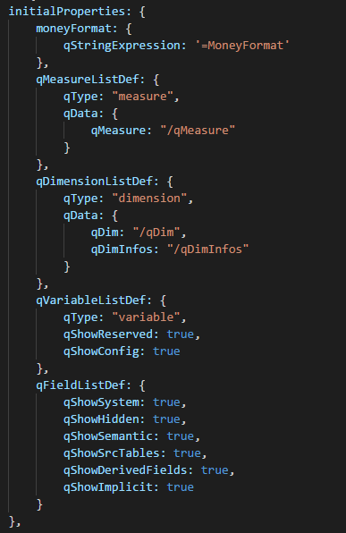
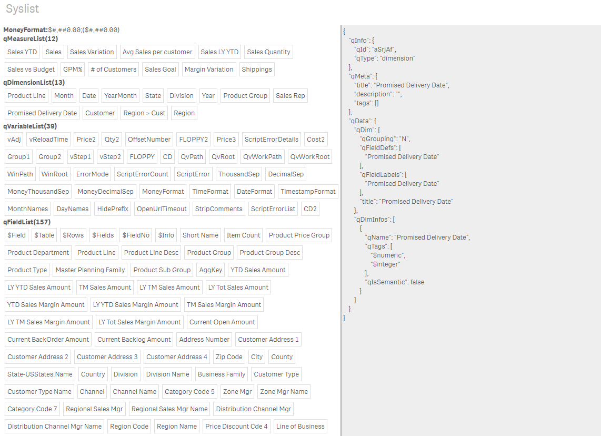

# syslist
Syslist extension for Qlik Sense: list system data

This extensions demonstrates how to get access to system data like dimensions and measures in yor extension.

You should not use the APIs for that, instead add the lists you need to initialProperties like in the extension and you will automatically get the data in your layout.

Looks like this in the extension:

The extension in itself is really not that useful. It allows you to explore the contents of the app, but you cannot do much useful with it.

You find more on this in my blog:
https://extendingqlik.upper88.com/accessing-system-data-and-variables-in-a-qlik-sense-extension/